# Data Vault model (Raw Vault) – Mermaid

Este documento representa el **Raw Vault** del proyecto (Hubs, Links y Satellites) usando Mermaid.

> Objetivo: tener un artefacto visual para facilitar el salto posterior a **star schemas** en `marts/`.

## Raw Vault ER diagram

## Raw Vault (solo Hubs + Links)

```mermaid
erDiagram
  %% ==================
  %% HUBS
  %% ==================
  HUB_CUSTOMER {
    string CUSTOMER_HK PK
    int C_CUSTKEY "NK"
  }

  HUB_ORDER {
    string ORDER_HK PK
    int O_ORDERKEY "NK"
  }

  HUB_PART {
    string PART_HK PK
    int P_PARTKEY "NK"
  }

  HUB_SUPPLIER {
    string SUPPLIER_HK PK
    int S_SUPPKEY "NK"
  }

  HUB_NATION {
    string NATION_HK PK
    int N_NATIONKEY "NK"
  }

  HUB_REGION {
    string REGION_HK PK
    int R_REGIONKEY "NK"
  }

  %% ==================
  %% LINKS
  %% ==================
  LINK_ORDER_CUSTOMER {
    string ORDER_CUSTOMER_HK PK
    string ORDER_HK FK
    string CUSTOMER_HK FK
  }

  LINK_LINEITEM {
    string LINEITEM_HK PK
    string ORDER_HK FK
    string PART_HK FK
    string SUPPLIER_HK FK
  }

  LINK_PART_SUPPLIER {
    string PART_SUPPLIER_HK PK
    string PART_HK FK
    string SUPPLIER_HK FK
  }

  LINK_CUSTOMER_NATION {
    string CUSTOMER_NATION_HK PK
    string CUSTOMER_HK FK
    string NATION_HK FK
  }

  LINK_SUPPLIER_NATION {
    string SUPPLIER_NATION_HK PK
    string SUPPLIER_HK FK
    string NATION_HK FK
  }

  LINK_NATION_REGION {
    string NATION_REGION_HK PK
    string NATION_HK FK
    string REGION_HK FK
  }

  %% ==================
  %% RELATIONSHIPS
  %% ==================
  HUB_ORDER ||--o{ LINK_ORDER_CUSTOMER : relates
  HUB_CUSTOMER ||--o{ LINK_ORDER_CUSTOMER : relates

  HUB_ORDER ||--o{ LINK_LINEITEM : relates
  HUB_PART ||--o{ LINK_LINEITEM : relates
  HUB_SUPPLIER ||--o{ LINK_LINEITEM : relates

  HUB_PART ||--o{ LINK_PART_SUPPLIER : relates
  HUB_SUPPLIER ||--o{ LINK_PART_SUPPLIER : relates

  HUB_CUSTOMER ||--o{ LINK_CUSTOMER_NATION : relates
  HUB_NATION ||--o{ LINK_CUSTOMER_NATION : relates

  HUB_SUPPLIER ||--o{ LINK_SUPPLIER_NATION : relates
  HUB_NATION ||--o{ LINK_SUPPLIER_NATION : relates

  HUB_NATION ||--o{ LINK_NATION_REGION : relates
  HUB_REGION ||--o{ LINK_NATION_REGION : relates
```

## Raw Vault ER diagram

```mermaid
erDiagram
  %% ==================
  %% HUBS
  %% ==================
  HUB_CUSTOMER {
    string CUSTOMER_HK PK
    int C_CUSTKEY "NK"
  }

  HUB_ORDER {
    string ORDER_HK PK
    int O_ORDERKEY "NK"
  }

  HUB_PART {
    string PART_HK PK
    int P_PARTKEY "NK"
  }

  HUB_SUPPLIER {
    string SUPPLIER_HK PK
    int S_SUPPKEY "NK"
  }

  HUB_NATION {
    string NATION_HK PK
    int N_NATIONKEY "NK"
  }

  HUB_REGION {
    string REGION_HK PK
    int R_REGIONKEY "NK"
  }

  %% ==================
  %% LINKS
  %% ==================
  LINK_ORDER_CUSTOMER {
    string ORDER_CUSTOMER_HK PK
    string ORDER_HK FK
    string CUSTOMER_HK FK
  }

  LINK_LINEITEM {
    string LINEITEM_HK PK
    string ORDER_HK FK
    string PART_HK FK
    string SUPPLIER_HK FK
  }

  LINK_PART_SUPPLIER {
    string PART_SUPPLIER_HK PK
    string PART_HK FK
    string SUPPLIER_HK FK
  }

  LINK_CUSTOMER_NATION {
    string CUSTOMER_NATION_HK PK
    string CUSTOMER_HK FK
    string NATION_HK FK
  }

  LINK_SUPPLIER_NATION {
    string SUPPLIER_NATION_HK PK
    string SUPPLIER_HK FK
    string NATION_HK FK
  }

  LINK_NATION_REGION {
    string NATION_REGION_HK PK
    string NATION_HK FK
    string REGION_HK FK
  }

  %% ==================
  %% SATELLITES
  %% ==================
  SAT_CUSTOMER {
    string CUSTOMER_HK FK
    string CUSTOMER_HASHDIFF
    timestamp LOAD_DATETIME
    string RECORD_SOURCE

    string C_NAME
    string C_ADDRESS
    string C_PHONE
    float C_ACCTBAL
    string C_MKTSEGMENT
    int C_NATIONKEY
    string C_COMMENT
  }

  SAT_ORDER {
    string ORDER_HK FK
    string ORDER_HASHDIFF
    timestamp LOAD_DATETIME
    string RECORD_SOURCE

    string O_ORDERSTATUS
    float O_TOTALPRICE
    string O_ORDERPRIORITY
    string O_CLERK
    date O_ORDERDATE
    int O_SHIPPRIORITY
    string O_COMMENT
  }

  SAT_PART {
    string PART_HK FK
    string PART_HASHDIFF
    timestamp LOAD_DATETIME
    string RECORD_SOURCE

    string P_NAME
    string P_MFGR
    string P_BRAND
    string P_TYPE
    int P_SIZE
    string P_CONTAINER
    float P_RETAILPRICE
    string P_COMMENT
  }

  SAT_SUPPLIER {
    string SUPPLIER_HK FK
    string SUPPLIER_HASHDIFF
    timestamp LOAD_DATETIME
    string RECORD_SOURCE

    string S_NAME
    string S_ADDRESS
    string S_PHONE
    float S_ACCTBAL
    int S_NATIONKEY
    string S_COMMENT
  }

  SAT_NATION {
    string NATION_HK FK
    string NATION_HASHDIFF
    timestamp LOAD_DATETIME
    string RECORD_SOURCE

    string N_NAME
    int N_REGIONKEY
    string N_COMMENT
  }

  SAT_REGION {
    string REGION_HK FK
    string REGION_HASHDIFF
    timestamp LOAD_DATETIME
    string RECORD_SOURCE

    string R_NAME
    string R_COMMENT
  }

  SAT_PART_SUPPLIER {
    string PART_SUPPLIER_HK FK
    string PART_SUPPLIER_HASHDIFF
    timestamp LOAD_DATETIME
    string RECORD_SOURCE

    int PS_AVAILQTY
    float PS_SUPPLYCOST
    string PS_COMMENT
  }

  SAT_LINEITEM {
    string LINEITEM_HK FK
    string LINEITEM_HASHDIFF
    timestamp LOAD_DATETIME
    string RECORD_SOURCE

    float L_QUANTITY
    float L_EXTENDEDPRICE
    float L_DISCOUNT
    float L_TAX
    string L_RETURNFLAG
    string L_LINESTATUS
    date L_SHIPDATE
    date L_COMMITDATE
    date L_RECEIPTDATE
    string L_SHIPINSTRUCT
    string L_SHIPMODE
    string L_COMMENT
  }

  SAT_ORDER_CUSTOMER {
    string ORDER_CUSTOMER_HK FK
    string ORDER_CUSTOMER_HASHDIFF
    timestamp LOAD_DATETIME
    string RECORD_SOURCE

    string ORDER_HK
    string CUSTOMER_HK
  }

  %% ==================
  %% RELATIONSHIPS
  %% ==================
  HUB_CUSTOMER ||--o{ SAT_CUSTOMER : has
  HUB_ORDER ||--o{ SAT_ORDER : has
  HUB_PART ||--o{ SAT_PART : has
  HUB_SUPPLIER ||--o{ SAT_SUPPLIER : has
  HUB_NATION ||--o{ SAT_NATION : has
  HUB_REGION ||--o{ SAT_REGION : has

  LINK_ORDER_CUSTOMER ||--o{ SAT_ORDER_CUSTOMER : has
  LINK_LINEITEM ||--o{ SAT_LINEITEM : has
  LINK_PART_SUPPLIER ||--o{ SAT_PART_SUPPLIER : has

  HUB_ORDER ||--o{ LINK_ORDER_CUSTOMER : relates
  HUB_CUSTOMER ||--o{ LINK_ORDER_CUSTOMER : relates

  HUB_ORDER ||--o{ LINK_LINEITEM : relates
  HUB_PART ||--o{ LINK_LINEITEM : relates
  HUB_SUPPLIER ||--o{ LINK_LINEITEM : relates

  HUB_PART ||--o{ LINK_PART_SUPPLIER : relates
  HUB_SUPPLIER ||--o{ LINK_PART_SUPPLIER : relates

  HUB_CUSTOMER ||--o{ LINK_CUSTOMER_NATION : relates
  HUB_NATION ||--o{ LINK_CUSTOMER_NATION : relates

  HUB_SUPPLIER ||--o{ LINK_SUPPLIER_NATION : relates
  HUB_NATION ||--o{ LINK_SUPPLIER_NATION : relates

  HUB_NATION ||--o{ LINK_NATION_REGION : relates
  HUB_REGION ||--o{ LINK_NATION_REGION : relates
```

## Notas

- Tipos (`string`, `int`, `float`, `date`, `timestamp`) son orientativos para el diagrama.
- `LOAD_DATETIME` y `RECORD_SOURCE` se incluyen en todos los satélites por consistencia.
- En DV, el satélite “cuelga” de su Hub o Link, y se identifica por `(HK, HASHDIFF, LOAD_DATETIME)`.
