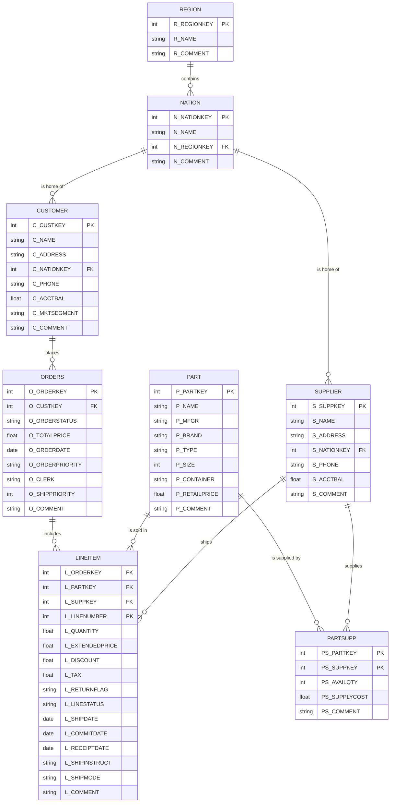

# Source tables

This document lists the source tables and their columns.

## CUSTOMER
- C_CUSTKEY  
- C_NAME  
- C_ADDRESS  
- C_NATIONKEY  
- C_PHONE  
- C_ACCTBAL  
- C_MKTSEGMENT  
- C_COMMENT

## LINEITEM
- L_ORDERKEY  
- L_PARTKEY  
- L_SUPPKEY  
- L_LINENUMBER  
- L_QUANTITY  
- L_EXTENDEDPRICE  
- L_DISCOUNT  
- L_TAX  
- L_RETURNFLAG  
- L_LINESTATUS  
- L_SHIPDATE  
- L_COMMITDATE  
- L_RECEIPTDATE  
- L_SHIPINSTRUCT  
- L_SHIPMODE  
- L_COMMENT

## NATION
- N_NATIONKEY  
- N_NAME  
- N_REGIONKEY  
- N_COMMENT

## ORDERS
- O_ORDERKEY  
- O_CUSTKEY  
- O_ORDERSTATUS  
- O_TOTALPRICE  
- O_ORDERDATE  
- O_ORDERPRIORITY  
- O_CLERK  
- O_SHIPPRIORITY  
- O_COMMENT

## PART
- P_PARTKEY  
- P_NAME  
- P_MFGR  
- P_BRAND  
- P_TYPE  
- P_SIZE  
- P_CONTAINER  
- P_RETAILPRICE  
- P_COMMENT

## PARTSUPP
- PS_PARTKEY  
- PS_SUPPKEY  
- PS_AVAILQTY  
- PS_SUPPLYCOST  
- PS_COMMENT

## REGION
- R_REGIONKEY  
- R_NAME  
- R_COMMENT

## SUPPLIER
- S_SUPPKEY  
- S_NAME  
- S_ADDRESS  
- S_NATIONKEY  
- S_PHONE  
- S_ACCTBAL  
- S_COMMENT

---

## Source ER diagram (Mermaid)

