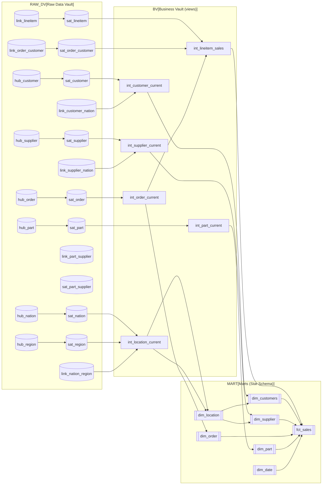

# Star Schema Architecture (Information Delivery Layer)

This document describes the target **Business Vault (views)** and **Marts (Star Schema)** layers built on top of the existing **Raw Data Vault**.

## Goals

- Provide **business-friendly naming** and a **robust** foundation for analytics.
- Preserve **traceability** by using **Data Vault Hash Keys (HK)** as surrogate keys in dimensions and facts.
- Model dimensions as **Current State** (latest satellite record per hub).
- Standardize shared conformed dimensions (e.g., **Location**, **Date**).

---

## Implementation rules (agreed)

1. **Business Vault (Views) first**  
   Create intermediate view models that flatten each Hub with the **latest active** record from its Satellite(s).  
   - Rename columns to business names (e.g. `C_NAME` → `customer_name`)
   - Apply soft cleaning rules (trim, upper/lower, null handling, standardization)
   - Keep DV keys for lineage: `*_hk`, `load_datetime`, `record_source`

2. **Primary Keys (PK)**  
   Use **HKs** from Data Vault as surrogate keys in downstream models:
   - `customer_hk`, `order_hk`, `part_hk`, `supplier_hk`, etc.

3. **History handling**  
   Marts represent **Current State** dimensions (latest satellite row per HK).

4. **Geography**
   - Create `dim_location` by joining **nation + region**.
   - `dim_customer` and `dim_supplier` must include `nation_name` and `region_name`.

---

## Logical schema (high level)



---

## Business Vault layer (views)

> Convention: **`int_*`** are **views** that provide business-friendly columns and represent current state.

### 1) `int_customer_current`
Source: `hub_customer` + latest `sat_customer` + geography via `link_customer_nation` → nation/region

Key columns:
- `customer_hk` (HK; used as downstream PK)
- `customer_id` (business key, e.g. `C_CUSTKEY`)
- `load_datetime`, `record_source`

Business columns:
- `customer_name`
- `address`
- `phone`
- `account_balance`
- `market_segment`
- `nation_name`
- `region_name`

Soft rules:
- `trim()` everywhere
- standardize casing for segments if needed

### 2) `int_supplier_current`
Source: `hub_supplier` + latest `sat_supplier` + geography via `link_supplier_nation`

Key columns:
- `supplier_hk`
- `supplier_id` (e.g. `S_SUPPKEY`)

Business columns:
- `supplier_name`
- `address`
- `phone`
- `account_balance`
- `nation_name`
- `region_name`

### 3) `int_order_current`
Source: `hub_order` + latest `sat_order`

Key columns:
- `order_hk`
- `order_id` (e.g. `O_ORDERKEY`)

Business columns:
- `order_status`
- `order_priority`
- `clerk_name`

Dates:
- `order_date` (keep as a date)

### 4) `int_part_current`
Source: `hub_part` + latest `sat_part`

Key columns:
- `part_hk`
- `part_id` (e.g. `P_PARTKEY`)

Business columns:
- `part_name`
- `brand`
- `type`
- `size`

### 5) `int_location_current`
Source: `hub_nation + sat_nation` joined to `hub_region + sat_region` (optionally through `link_nation_region`)

Key columns:
- `nation_hk`
- `region_hk`

Business columns:
- `nation_id`, `nation_name`
- `region_id`, `region_name`

### 6) `int_lineitem_sales`
Purpose: provide a mart-ready, lineitem-grain record.
Source: `link_lineitem` + latest `sat_lineitem` + `int_order_current` (for `order_date`) + `link_order_customer` (for `customer_hk`)

Key columns (hash FKs):
- `order_hk`
- `customer_hk`
- `part_hk`
- `supplier_hk`

Dates:
- `order_date`
- `ship_date`
- `receipt_date`

Measures:
- `quantity`
- `extended_price`
- `discount_percentage`
- `tax_percentage`

Derived measures:
- `item_total_price = quantity * extended_price`
- `net_revenue = item_total_price * (1 - discount_percentage)`

---

## Mart layer (Star Schema)

### Fact: `fct_sales` (grain: **lineitem**)
Primary key:
- Could be `lineitem_hk` (from `link_lineitem`) **or** a deterministic composite key; preferred: `lineitem_hk`.

Foreign keys (HKs):
- `order_hk`
- `customer_hk`
- `part_hk`
- `supplier_hk`

Dates:
- `order_date`
- `ship_date`
- `receipt_date`

Measures:
- `quantity`
- `extended_price`
- `discount_percentage`
- `tax_percentage`
- `item_total_price`
- `net_revenue`

### Dimensions

#### `dim_customers`
PK:
- `customer_hk`

Attributes:
- `customer_id`
- `customer_name`
- `market_segment`
- `nation_name`
- `region_name`

#### `dim_order`
PK:
- `order_hk`

Attributes:
- `order_id`
- `order_status`
- `order_priority`
- `clerk_name`

#### `dim_part`
PK:
- `part_hk`

Attributes:
- `part_id`
- `part_name`
- `brand`
- `type`
- `size`

#### `dim_supplier`
PK:
- `supplier_hk`

Attributes:
- `supplier_id`
- `supplier_name`
- `nation_name`
- `region_name`

#### `dim_location`
PK:
- `nation_hk` (or a separate `location_hk` if you want a single key)
Attributes:
- `nation_id`, `nation_name`
- `region_id`, `region_name`

#### `dim_date`
Approach options:
- Use `dbt_utils.date_spine` to generate a date range, then enrich with calendar attributes
- Or seed a standard date dimension

---

## Proposed dbt project structure

> Keep the pattern already used in the repo (numbered layers) and add two new ones.

```text
models/
  01_staging/
    tpch/
      ...
  02_raw_vault/
    hubs/
    links/
    satellites/
    _raw_vault_models.yml

  03_business_vault/
    core/
      int_customer_current.sql
      int_supplier_current.sql
      int_order_current.sql
      int_part_current.sql
      int_location_current.sql
      int_lineitem_sales.sql
    _business_vault_models.yml

  04_marts/
    core/
      dim_customers.sql
      dim_supplier.sql
      dim_order.sql
      dim_part.sql
      dim_location.sql
      dim_date.sql
      fct_sales.sql
    _marts_models.yml
```

Materializations (suggested):
- `03_business_vault`: `view`
- `04_marts`: `table` (or `incremental` for `fct_sales` if needed)

---

## Open decisions (to confirm before building)

1. **Fact PK**: use `LINEITEM_HK` directly as fact PK (recommended).
2. **dim_location PK**: keep `nation_hk` as PK, or create a dedicated `location_hk`.
3. **dim_date generation**: seed vs `date_spine`.

Once you confirm these 3, we can scaffold the actual dbt models for `03_business_vault` and `04_marts` consistently.

