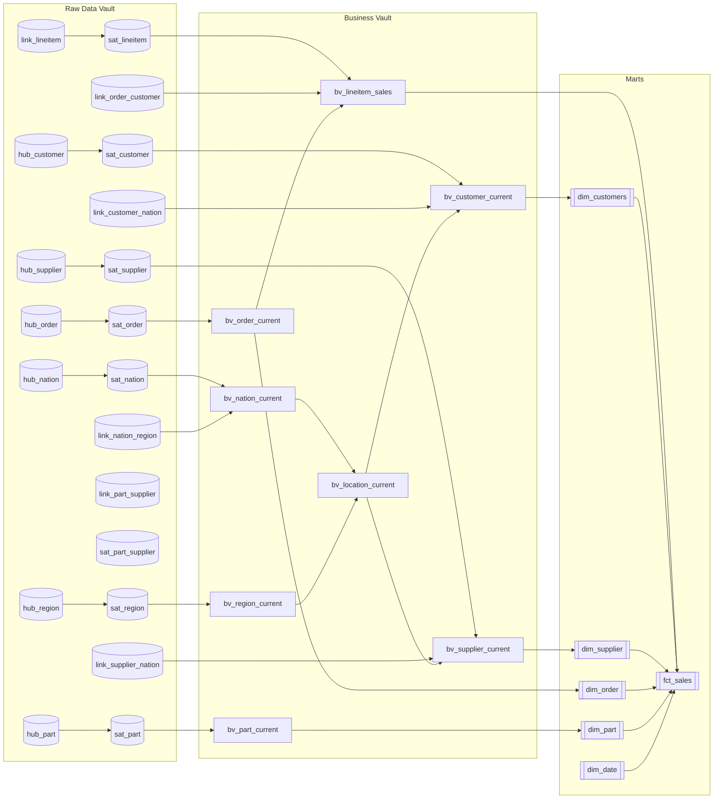

# Star Schema Architecture (Information Delivery Layer)

This document describes the **Business Vault** and **Marts** layers built on the **Raw Data Vault**, as implemented in this repository. For source-to-hub/link/sat mapping, see `source_to_data_vault.md` and `data_vault_architecture.md`.

## Goals

- Provide **business-friendly naming** and a stable surface for analytics.
- Preserve **traceability** by using **Data Vault hash keys (`*_hk`)** as surrogate keys in dimensions and facts.
- Expose **current state** for hubs and links used downstream, resolved with **PIT** (`pit_*`) + `as_of_date` (see `models/03_business_vault/`).
- Reuse **conformed geography** via `bv_location_current` (nation + region names) for customer and supplier dimensions.

---

## Implementation rules (as built)

1. **Business Vault first (`bv_*`)**  
   View/table models that flatten hubs (and lineitem grain) to business columns, joining **PIT** outputs to the correct **satellite row** for the snapshot in `as_of_date`.  
   - Business names (e.g. `C_NAME` → `customer_name`)  
   - Light cleaning (`trim`, `upper` where applied in SQL)  
   - Lineage fields retained where modeled: `load_datetime`, `record_source`

2. **Primary keys**  
   Downstream PKs/FKs use DV hash keys: `customer_hk`, `order_hk`, `part_hk`, `supplier_hk`, `lineitem_hk`, etc.

3. **Current state**  
   Marts dimensions and `bv_lineitem_sales` reflect **one row per business key** (or lineitem) for the snapshot driven by `as_of_date` and automate_dv PIT macros.

4. **Geography**  
   `bv_location_current` joins `bv_nation_current` and `bv_region_current` (region via `link_nation_region` already reflected in `bv_nation_current`).  
   `dim_customers` and `dim_supplier` expose **`nation_name`** and **`region_name`** (denormalized); there is **no** separate `dim_location` mart model.

5. **Order–Customer**  
   There is **no** `sat_order_customer`. `customer_hk` on orders-at-lineitem grain comes from **`link_order_customer`** joined in `bv_lineitem_sales`.

---

## Logical schema (high level)



---

## Business Vault layer (`models/03_business_vault/`)

**Convention:** `bv_*` models are the business-facing layer. **PIT** models (`pit_*`) and `as_of_date` implement the point-in-time bridge to satellites (see `_business_vault_models.yml`).

### `as_of_date`

Snapshot spine consumed by `automate_dv.pit()` (single current row in the default setup; extend for historical PITs if needed).

### `bv_customer_current`

**Source:** `hub_customer` → `pit_customer` → `sat_customer`; `link_customer_nation` for `nation_hk`; `bv_location_current` for `nation_name`, `region_hk`, `region_name`.

**Notable columns:** `customer_hk`, `customer_id`, `customer_name`, `address`, `phone`, `account_balance`, `market_segment`, `nation_hk`, `region_hk`, `nation_name`, `region_name`, `load_datetime`, `record_source`.

### `bv_supplier_current`

**Source:** `hub_supplier` → `pit_supplier` → `sat_supplier`; `link_supplier_nation`; `bv_location_current`.

**Notable columns:** `supplier_hk`, `supplier_id`, `supplier_name`, `address`, `phone`, `account_balance`, `nation_hk`, `region_hk`, `nation_name`, `region_name`, `load_datetime`, `record_source`.

### `bv_order_current`

**Source:** `hub_order` → `pit_order` → `sat_order`.

**Notable columns:** `order_hk`, `order_id`, `order_status`, `order_priority`, `clerk_name`, `order_date`, `load_datetime`, `record_source`.

### `bv_part_current`

**Source:** `hub_part` → `pit_part` → `sat_part`.

**Notable columns:** `part_hk`, `part_id`, `part_name`, `brand`, `part_type`, `part_size`, `container`, `retail_price`, `load_datetime`, `record_source`.

### `bv_nation_current` / `bv_region_current`

**Source:** hub + PIT + satellite for nation and region respectively; `bv_nation_current` includes `region_hk` from `link_nation_region`.

### `bv_location_current`

**Source:** `bv_nation_current` left join `bv_region_current` on `region_hk`.

**Notable columns:** `nation_hk`, `nation_id`, `nation_name`, `region_hk`, `region_id`, `region_name`, load timestamps per entity.

### `bv_lineitem_sales`

**Grain:** one row per `lineitem_hk`.

**Source:** `link_lineitem` → `pit_lineitem` → `sat_lineitem`; `bv_order_current` for `order_date`; **`link_order_customer`** for `customer_hk` (no link satellite).

**Measures / derived:** `quantity`, `extended_price`, `discount_percentage`, `tax_percentage`, `item_total_price`, `net_revenue`; dates `order_date`, `ship_date`, `commit_date`, `receipt_date` and `*_date_id` casts for role-playing joins to `dim_date`.

---

## Mart layer (`models/04_marts/core/`)

Materializations follow `dbt_project.yml` (marts: **tables** on database `ANALYTICS`, schema `MARTS`).

### `fct_sales`

- **Grain:** lineitem (`lineitem_hk` is the logical grain; incremental `unique_key`: `lineitem_hk`).
- **FKs:** `order_hk`, `customer_hk`, `part_hk`, `supplier_hk`.
- **Date keys:** `order_date_id`, `ship_date_id`, `receipt_date_id` (and raw dates).
- **Measures:** `quantity`, `extended_price`, `discount_percentage`, `tax_percentage`, `item_total_price`, `net_revenue`, `load_datetime`.

**Build:** `select` from `bv_lineitem_sales` with incremental filter on `load_datetime`.

### `dim_customers` / `dim_supplier` / `dim_order` / `dim_part`

Thin selects over the corresponding `bv_*` models; attributes match `_marts_models.yml`.

- **`dim_order`** includes `order_date_id` (date spine join key).
- **`dim_part`** exposes `part_type` and `part_size` (mart naming), not every BV attribute.

### `dim_date`

Generated with **`dbt_utils.date_spine`** (1990-01-01 through 2030-12-31) plus calendar attributes (`year`, `quarter`, `month`, `week`, `day`, `day_name`, `month_name`, `is_weekend`). **`date_id`** is the calendar date.

---

## dbt project layout (reference)

```text
models/
  01_staging/tpch/
  02_raw_vault/
    hubs/  links/  satellites/
  03_business_vault/
    as_of_date.sql
    pit/
    core/
      bv_customer_current.sql
      bv_supplier_current.sql
      bv_order_current.sql
      bv_part_current.sql
      bv_nation_current.sql
      bv_region_current.sql
      bv_location_current.sql
      bv_lineitem_sales.sql
  04_marts/
    core/
      dim_customers.sql
      dim_supplier.sql
      dim_order.sql
      dim_part.sql
      dim_date.sql
      fct_sales.sql
```

---

## Notes

- **`dim_location`** is not implemented as a mart; geography for customers and suppliers is denormalized into their dimensions via `bv_location_current`.
- Raw Vault payloads and links are documented in **`source_to_data_vault.md`**; the Mermaid Raw Vault diagram lives in **`data_vault_architecture.md`**.
